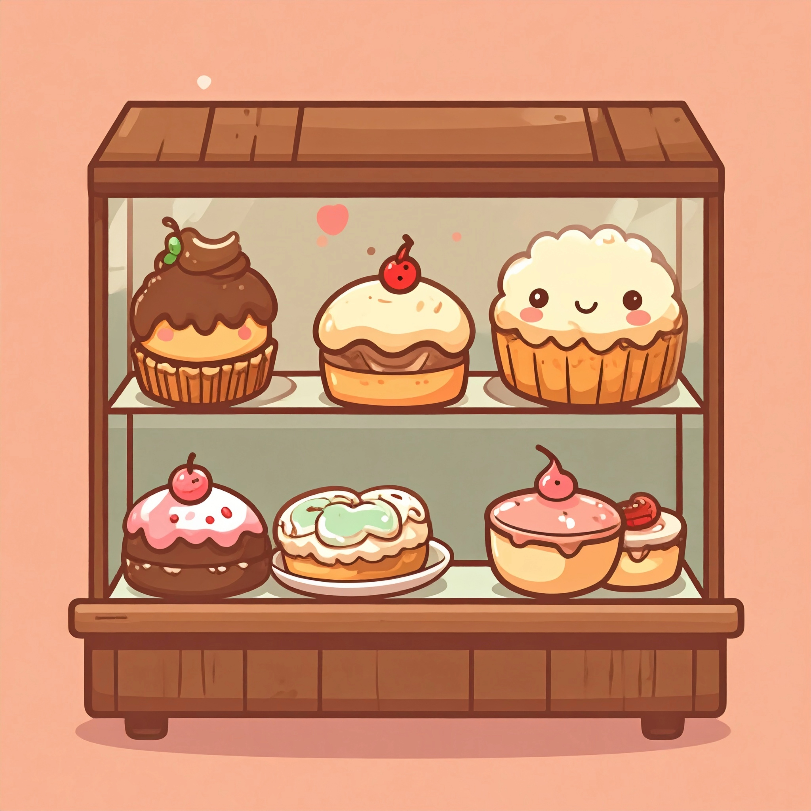

# 🧁 Fufu Dessert - Isometric Cafe Management Game

A charming Flutter-based mobile dessert shop management game featuring an isometric tile-based cafe system with AI-powered customers, furniture management, and dessert crafting.



## 📋 Table of Contents

- [Overview](#overview)
- [System Requirements](#system-requirements)
- [Installation & Setup](#installation--setup)
- [Project Structure](#project-structure)
- [Gameplay Features](#gameplay-features)
- [Technical Architecture](#technical-architecture)
- [Asset Requirements](#asset-requirements)
- [Development Guide](#development-guide)
- [Troubleshooting](#troubleshooting)

## 🎮 Overview

Fufu Dessert is a cafe management simulation game where players:
- Manage an isometric tile-based cafe with a 20x20 grid system
- Serve AI-powered animal customers (bears, cats, foxes, pandas, rabbits)
- Craft and merge desserts to fulfill customer orders
- Decorate and expand their cafe with various furniture pieces
- Handle customer pathfinding, seating, and satisfaction systems

## 💻 System Requirements

### Minimum Requirements
- **Flutter SDK**: 3.9.0 or higher
- **Dart SDK**: 3.9.0 or higher
- **Android**: API level 21+ (Android 5.0+)
- **iOS**: iOS 11.0+
- **RAM**: 4GB minimum, 8GB recommended
- **Storage**: 2GB free space

### Development Environment
- **IDE**: VS Code, Android Studio, or IntelliJ IDEA
- **Emulator/Device**: Android emulator or physical device for testing
- **Git**: For version control

## 🚀 Installation & Setup

### 1. Clone the Repository
```bash
git clone <your-repository-url>
cd fufu_dessert2
```

### 2. Install Flutter Dependencies
```bash
flutter pub get
```

### 3. Verify Flutter Installation
```bash
flutter doctor
```

### 4. Prepare Assets
Ensure all required assets are in place:
```
assets/
├── audio/
│   ├── Children's March Theme.mp3
│   ├── bubble_click.ogg
│   ├── doorbell.mp3
│   ├── level_up.mp3
│   └── moeny_merge.mp3
├── images/
│   ├── characters/
│   │   ├── bear.png
│   │   ├── cat.png
│   │   ├── fox.png
│   │   ├── panda.png
│   │   ├── rabbit.png
│   │   └── fufu.png
│   └── funiture/
│       ├── display.png
│       ├── table_2.png
│       ├── plant.png
│       └── menu.png
├── floor/
│   ├── blue.png
│   └── yellow.png
└── walls/
    └── basic_wall.png
```

### 5. Run the Application
```bash
# For debug mode
flutter run

# For release mode
flutter run --release
```

## 📁 Project Structure

```
lib/
├── main.dart                     # App entry point
├── models/                       # Data models
│   ├── customer.dart            # Customer AI and behavior
│   ├── furniture.dart           # Furniture items and placement
│   ├── dessert.dart            # Dessert items and recipes
│   ├── craftable_dessert.dart  # Complex dessert crafting
│   └── storage.dart            # Inventory management
├── providers/                    # State management
│   ├── cafe_provider.dart      # Cafe state and furniture
│   ├── customer_provider.dart  # Customer management
│   └── game_provider.dart      # Game progression
├── screens/                     # UI screens
│   ├── game_screen.dart        # Main game interface
│   ├── crafting_screen.dart    # Dessert crafting
│   ├── settings_screen.dart    # Game settings
│   └── tutorial_screen.dart    # Tutorial system
├── widgets/                     # UI components
│   ├── tile_based_cafe_system.dart  # Main cafe view
│   ├── customer_widget.dart         # Customer rendering
│   ├── merge_grid_widget.dart       # Merge game grid
│   └── ui_overlay_widget.dart       # Game UI overlay
├── services/                    # Core services
│   ├── database_service.dart   # SQLite database
│   ├── audio_service.dart      # Sound management
│   └── tutorial_service.dart   # Tutorial guidance
├── game/                       # Game engine components
│   ├── pathfinding/           # A* pathfinding system
│   ├── collision/             # Spatial collision detection
│   ├── ai/                    # Character AI behavior
│   └── systems/               # Game systems
└── utils/                     # Utility functions
    ├── animations.dart        # Animation helpers
    └── grid_mapper.dart      # Grid coordinate mapping
```

## 🎯 Gameplay Features

### Core Systems

#### 1. Isometric Cafe Management
- **20x20 tile grid** with isometric diamond-shaped floor tiles
- **Blue and yellow checkerboard pattern** with proper perspective
- **Edit mode** with visual grid overlay for precise furniture placement
- **Camera controls**: Pan, zoom, and navigate the cafe space

#### 2. Furniture System
- **19+ furniture types** including:
  - **Service**: Display cases, cash registers, counters
  - **Seating**: Tables (2-10 person capacity), booths, sofas
  - **Decoration**: Plants, lighting, entertainment items
  - **Kitchen**: Coffee machines, ovens, fridges
  - **Premium**: Fountains, aquariums, pianos
- **Progressive unlock system** based on shop level
- **Upgrade mechanics** for expandable furniture
- **Attraction bonus system** affecting customer satisfaction

#### 3. Customer AI System
- **5 animal customer types**: Bear 🐻, Cat 🐱, Fox 🦊, Panda 🐼, Rabbit 🐰
- **Advanced pathfinding** using A* algorithm with spatial grid optimization
- **Customer lifecycle**:
  1. **Entering** → **Walking to Counter** → **Ordering**
  2. **Walking to Table** → **Sitting** → **Eating**
  3. **Walking to Exit** → **Leaving**
- **Dynamic seating assignment** based on table capacity
- **Patience system** with visual indicators
- **Order complexity** scaling with shop level

#### 4. Order & Crafting System
- **Merged Desserts**: Level 1-10 desserts from merge grid
- **Crafted Desserts**: Complex recipes requiring multiple ingredients
- **Progressive difficulty** - customers order higher levels as shop grows
- **Fallback system** for unavailable recipes

#### 5. Audio & Visual Effects
- **Background music**: Children's March Theme
- **Sound effects**: Door bells, money sounds, level up notifications
- **Visual feedback**: Dragging effects, selection highlights
- **Smooth animations** for customer movement and interactions

### Game Progression

#### Shop Levels & Unlocks
- **Level 1-2**: Basic gameplay, simple orders
- **Level 3+**: Furniture store unlocks
- **Level 5+**: Advanced furniture types
- **Level 7+**: Premium decorations
- **Level 9+**: Luxury items and complex recipes

#### Customer Capacity System
- **Base capacity**: 4 customers
- **Seating expansion**: Add tables/booths to increase capacity
- **Maximum capacity**: Scales with furniture placement

## 🔧 Technical Architecture

### Core Technologies
- **Flutter**: Cross-platform mobile framework
- **Provider**: State management
- **SQLite**: Local database storage
- **Flame**: 2D game engine components
- **Custom Canvas Painting**: Isometric rendering system

### Key Components

#### 1. Tile-Based Rendering System (`tile_based_cafe_system.dart`)
```dart
// 20x20 isometric grid with diamond tiles
const floorTilesX = 20;
const floorTilesY = 20;

// Isometric projection calculations
final isoX = (roomX - roomY) * tileWidth * 0.5;
final isoY = (roomX + roomY) * tileHeight * 0.25;
```

#### 2. Pathfinding Engine (`game/pathfinding/`)
- **A* algorithm** implementation
- **Spatial grid optimization** for collision detection
- **Dynamic obstacle avoidance** around furniture
- **Multi-customer pathfinding** without conflicts

#### 3. State Management Architecture
- **CafeProvider**: Manages furniture, layout, shop progression
- **CustomerProvider**: Handles customer spawning, AI, orders
- **GameProvider**: Controls game state, progression, statistics

#### 4. Database Schema (`database_service.dart`)
```sql
-- Core tables
CREATE TABLE shop_progress (level, coins, experience);
CREATE TABLE furniture_inventory (furniture_id, quantity, unlocked);
CREATE TABLE customer_history (visit_date, satisfaction, order_level);
CREATE TABLE game_statistics (total_customers, revenue, avg_satisfaction);
```

## 🎨 Asset Requirements

### Image Assets
- **Character sprites**: 64x64px PNG files for each customer type
- **Furniture sprites**: Varying sizes, isometric perspective recommended
- **Floor tiles**: `blue.png` and `yellow.png` for checkerboard pattern
- **Wall textures**: `basic_wall.png` for room background

### Audio Assets
- **Background music**: `.mp3` format, looping
- **Sound effects**: `.ogg` format for compatibility
- **Volume normalization**: -20dB to -6dB range

### Asset Naming Convention
```
assets/
├── images/characters/{type}.png     # bear.png, cat.png, etc.
├── images/furniture/{item}.png      # table_2.png, plant.png, etc.
├── floor/{color}.png               # blue.png, yellow.png
├── walls/{type}.png                # basic_wall.png
└── audio/{effect}.{format}         # doorbell.mp3, bubble_click.ogg
```

## 🛠️ Development Guide

### Adding New Furniture
1. **Define in `models/furniture.dart`**:
```dart
Furniture(
  id: 'new_item_id',
  type: FurnitureType.decoration,
  name: 'New Item',
  emoji: '🎯',
  level: 2,
  price: 100,
  width: 1.0,
  height: 1.0,
  color: Colors.blue,
  attractionBonus: 5,
  canUpgrade: false,
),
```

2. **Add sprite asset** to `assets/images/furniture/`
3. **Update unlock logic** in `getAvailableForLevel()`

### Adding New Customer Types
1. **Add to `CustomerType` enum** in `models/customer.dart`
2. **Create sprite** in `assets/images/characters/`
3. **Update customer factory** in `CustomerProvider`
4. **Define behavior patterns** in customer AI

### Customizing Game Balance
Edit configuration constants in respective files:
- **Customer spawn rates**: `customer_system.dart`
- **Patience values**: `models/customer.dart`
- **Furniture prices**: `models/furniture.dart`
- **Shop progression**: `providers/game_provider.dart`

### Performance Optimization
- **Sprite caching**: Images loaded once and reused
- **Spatial partitioning**: Grid-based collision detection
- **State optimization**: Minimal rebuilds with Provider
- **Memory management**: Dispose controllers and listeners

## 🐛 Troubleshooting

### Common Issues

#### 1. Asset Loading Errors
```
Error: Unable to load asset: 'assets/floor/blue.png'
```
**Solution**: Verify `pubspec.yaml` includes all asset directories:
```yaml
flutter:
  assets:
    - assets/images/
    - assets/floor/
    - assets/walls/
    - assets/audio/
```

#### 2. GestureDetector Conflicts
```
Error: Cannot have both onPan* and onScale* callbacks
```
**Solution**: Use only `onScale*` callbacks for pan/zoom functionality.

#### 3. Performance Issues
- **Symptoms**: Frame drops, slow rendering
- **Solutions**:
  - Reduce grid size if needed
  - Optimize sprite sizes (max 512x512px)
  - Limit simultaneous customers (8-12 recommended)

#### 4. Pathfinding Errors
- **Symptoms**: Customers stuck or taking strange paths
- **Solutions**:
  - Ensure furniture placement doesn't block all paths
  - Check obstacle grid updates when furniture moves
  - Verify entrance/exit points are accessible

### Debug Commands

#### Enable Debug Mode
```dart
// In main.dart or relevant widget
const bool kDebugMode = true; // Shows pathfinding grid, collision bounds
```

#### Performance Monitoring
```bash
# Flutter performance overlay
flutter run --profile

# Memory debugging
flutter run --debug --dart-define=FLUTTER_WEB_USE_SKIA=true
```

#### Database Inspection
```dart
// In database_service.dart
void debugPrintTables() {
  // Prints current database state
}
```

## 🎯 Game Design Philosophy

The game is designed around **progressive complexity** and **player agency**:

1. **Start Simple**: Basic cafe with minimal furniture
2. **Gradual Expansion**: Unlock new furniture and customer types
3. **Strategic Decisions**: Balance customer capacity vs. satisfaction
4. **Visual Appeal**: Isometric perspective creates engaging 3D-like experience
5. **AI Immersion**: Customers behave naturally with realistic pathfinding

## 📈 Future Enhancements

Potential areas for expansion:
- **Multiplayer mode**: Visit friends' cafes
- **Seasonal events**: Holiday-themed decorations and recipes
- **Staff management**: Hire AI helpers for automation
- **Delivery system**: Expand beyond dine-in service
- **Custom decorations**: Player-created furniture and themes

## 📝 License

This project is private and proprietary. All assets and code are owned by the project creators.

## 🤝 Contributing

For development contributions:
1. Fork the repository
2. Create a feature branch
3. Follow the existing code style
4. Add tests for new functionality
5. Submit a pull request with detailed description

## 📞 Support

For technical support or questions:
- Check the troubleshooting section above
- Review existing GitHub issues
- Create a new issue with detailed reproduction steps

---

**Happy Cafe Managing!** 🧁✨

> Built with ❤️ using Flutter and lots of caffeine ☕